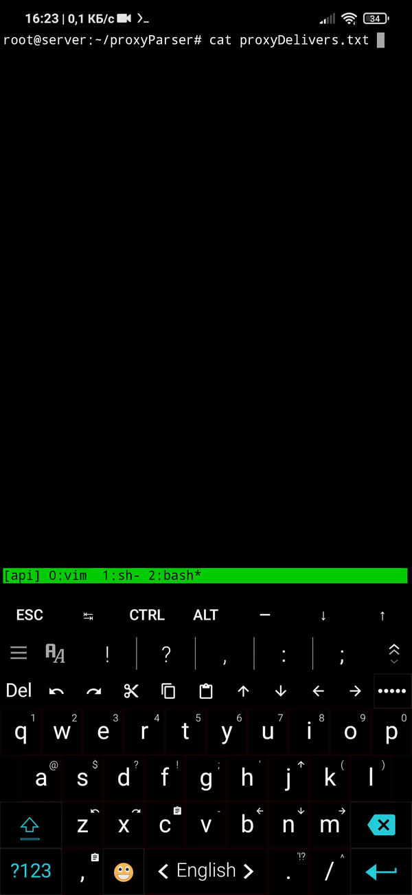

# Multithreading proxy parser

## Installation
```sh
sudo apt install python3 python3-pip
pip3 install bs4 fake_useragent brotli colorama requests lxml
chmod +x ./parse.py
```

## Usage
- Add URLs with proxies to "proxyDelivers.txt"
- Run ./parse.py
- Have profit in "proxies.txt"

